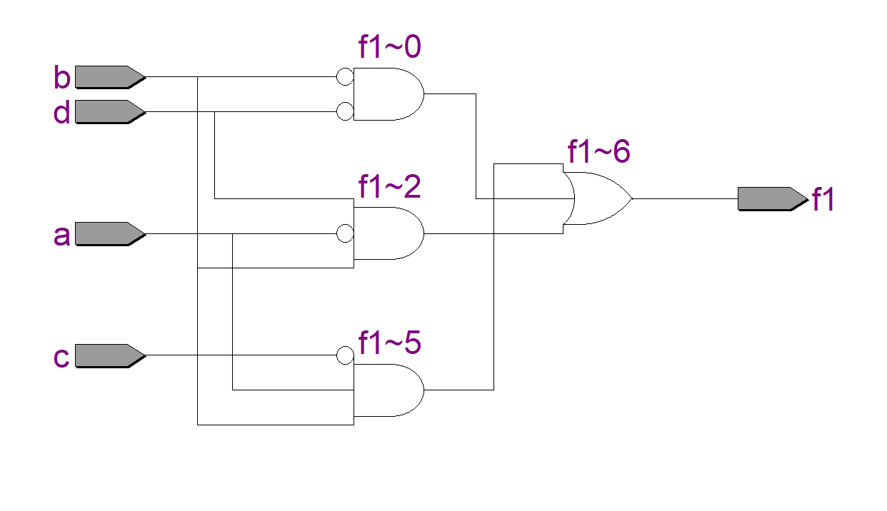
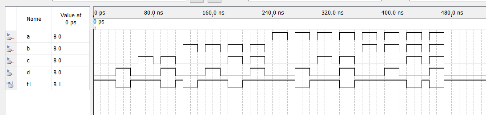
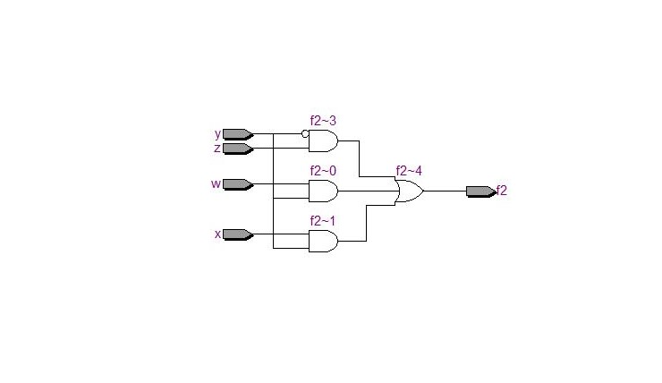
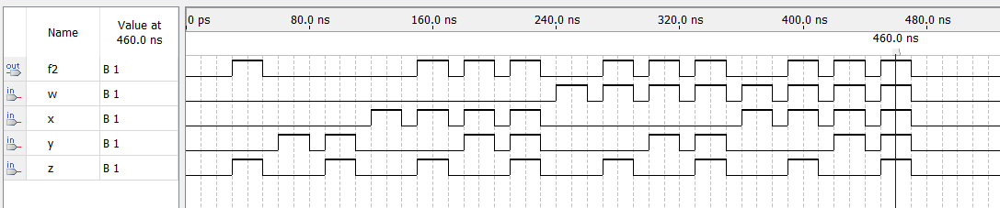

# Experiment--02-Implementation-of-combinational-logic
Implementation of combinational logic gates
 
## AIM:
To implement the given logic function verify its operation in Quartus using Verilog programming.

    F1= A’B’C’D’+AC’D’+B’CD’+A’BCD+BC’D
    F2=xy’z+x’y’z+w’xy+wx’y+wxy
 
 
 
## Equipments Required:
## Hardware
    PCs, Cyclone II , USB flasher
## Software 
    Quartus prime


## Theory
Logic gates are electronic circuits which perform logical functions on one or more inputs to produce one output.

## Logic Diagram
## Procedure:
### step-1
Create a project with required entities.

### step-2
Create a module along with respective file name.

### step-3
Run the respective programs for the given boolean equations.

### step-4
Run the module and get the respective RTL outputs.

### step-5 
Create university program(VWF) for getting timing diagram.

6.Give the respective inputs for timing diagram and obtain the results.
## Program:
Program to implement the given logic function and to verify its operations in quartus using Verilog programming.

### Developed by:  SARVESH KARAN V K 
### RegisterNumber: 212221230089

### F1:
```
module dd (a,b,c,d,f1);
input a,b,c,d;
output f1;
assign f1 = (~b&~d)|(~a&b&d)|(a&b&~c);
endmodule 
```

### F2:
```
module dd (w,x,,y,z,f2);
input w,x,y,z;
output f2;
assign f2 = (w&y)|(x&y)|(~y&z);
endmodule
```
## Output:
## F1:
### RTL realization:

### Timing Diagram:


## F2:
### RTL realization:

### Timing Diagram:

## Result
Thus the given logic functions are implemented using  and their operations are verified using Verilog programming.
